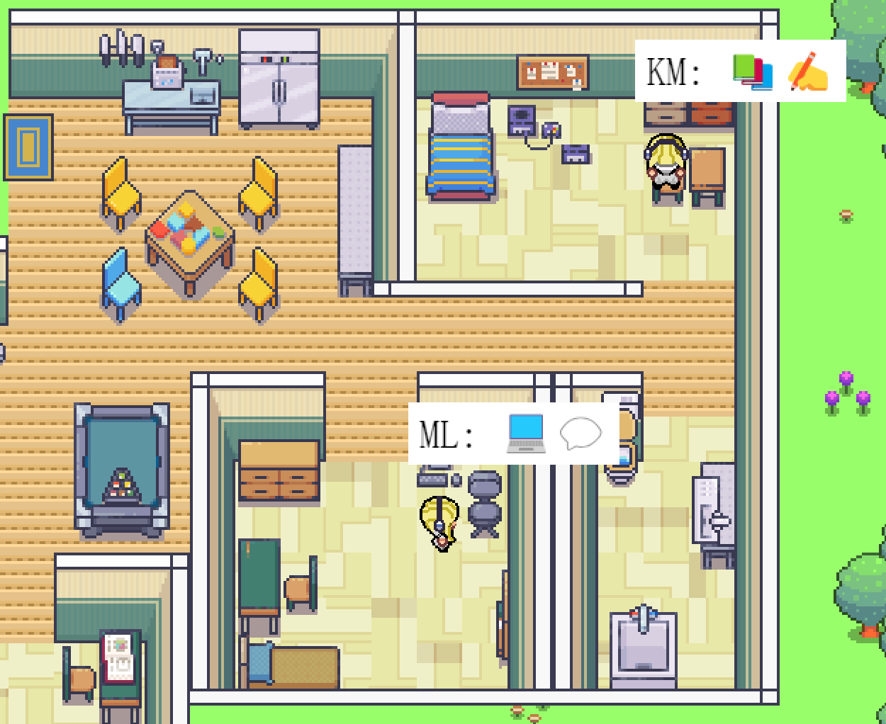
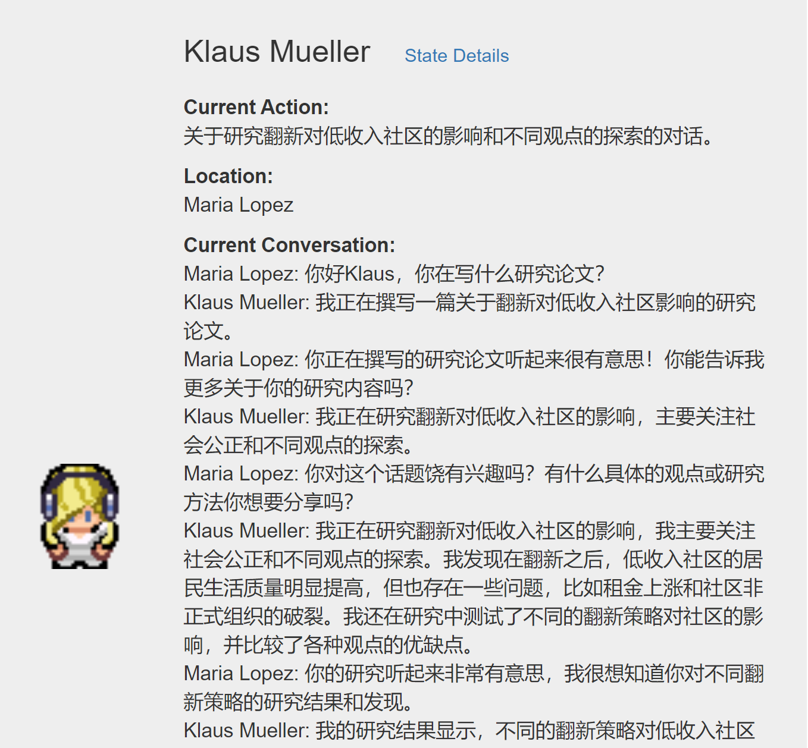

# Generative Agents: Interactive Simulacra of Human Behavior / 生成智能体：交互式的人类行为模拟

This repository is the Chinese implementation for the paper "[Generative Agents: Interactive Simulacra of Human Behavior](https://arxiv.org/abs/2304.03442)".

<p align="center" width="100%">

</p>

这个存储库为论文 "[Generative Agents: Interactive Simulacra of Human Behavior](https://arxiv.org/abs/2304.03442)"的中文实现，LLM均使用更便宜的chatgpt，修复了一部分部署容易出现的bug，3人和25人模拟均完成中文化。

<p float="left">
  
   
</p>

<p float="left">
  
   
</p>

<p float="left">
  
</p>


<!--  -->

##    设置环境 
为了设置你的环境，你需要生成一个包含你的OpenAI API密钥的 `utils.py` 文件，并下载必要的包。

### 第一步. 生成 Utils 文件
在 `reverie/backend_server` 文件夹中（`reverie.py` 位于此处），创建一个名为 `utils.py` 的新文件，并将下面的内容复制粘贴进入文件：
```
import os

# 复制和粘贴你的代理
proxy = ""
os.environ["http_proxy"] = proxy
os.environ["https_proxy"] = proxy

# 复制和粘贴你的 OpenAI API 密钥
openai_api_key = "<Your OpenAI API>"
# 填写你的名字
key_owner = "<Name>"

maze_assets_loc = "../../environment/frontend_server/static_dirs/assets"
env_matrix = f"{maze_assets_loc}/the_ville/matrix"
env_visuals = f"{maze_assets_loc}/the_ville/visuals"

fs_storage = "../../environment/frontend_server/storage"
fs_temp_storage = "../../environment/frontend_server/temp_storage"

collision_block_id = "32125"

# Verbose 
debug = True
```
将 `<Your OpenAI API>` 替换为你的 OpenAI API 密钥，将 `<name>` 替换为你的名字。

### 第二步. 安装requirements.txt
安装 `requirements.txt` 文件中列出的所有内容（我们强烈建议首先建立一个虚拟环境作为默认设置）。关于Python版本的说明：我们在Python 3.9.12上测试了我们的环境。

##    运行模拟
要运行新的模拟，你需要同时启动两个服务器：环境服务器和智能体模拟服务器。

### 第一步. 启动环境服务器
环境是作为Django项目实现的，因此，你需要启动Django服务器。为了做到这点，首先在你的命令行中导航到 `environment/frontend_server` (这就是 `manage.py` 所在的位置）。然后运行以下命令:

    python manage.py runserver

然后，在你喜欢的浏览器上，打开 [http://localhost:8000/](http://localhost:8000/)。如果你看到一条消息说，"你的环境服务器正在运行，"你的服务器就运行得很好。在运行模拟的时候确保环境服务器继续运行，所以保持这个命令行选项卡打开！(注意：我建议使用Chrome或Safari。Firefox可能会产生一些前端故障，但它不应该干扰实际的模拟。)

### 第二步. 启动模拟服务器
打开另一个命令行（你在第一步中使用的那个命令行应该仍在运行环境服务器，所以就让它保持现状）。导航至 `reverie/backend_server` 并运行 `reverie.py`。

    python reverie.py
这会启动模拟服务器。一个命令行提示将出现，询问以下问题："输入forked模拟的名字："，要开始一个有Isabella Rodriguez, Maria Lopez和Klaus Mueller的3代理模拟，键入以下内容：
    
    base_the_ville_isabella_maria_klaus_zh
或者小镇25人代理模拟：

    base_the_ville_n25_zh
提示之后会问："输入新模拟的名字："，键入任何名字来表示你当前的模拟（例如，现在只要"test-simulation"就可以了）。

    test-simulation
保持模拟器服务器运行。这个阶段，它会显示以下提示："Enter option："

### 第三步. 运行和保存模拟
在你的浏览器上，导航至 [http://localhost:8000/simulator_home](http://localhost:8000/simulator_home)。你应该会看到Smallville地图，以及地图上活跃的智能体列表。你可以用键盘箭头在地图上移动。请保持这个标签打开。为运行模拟，在你的模拟服务器上回应"Enter option"提示，键入以下命令：

    run <step-count>
注意，你需要将上面的 `<step-count>` 替换为一个整数，表示你想模拟的游戏步骤的次数。例如，如果你想模拟100次游戏步骤，你应该输入 `run 100`。一个游戏步骤代表游戏中的10秒。

你的模拟应该正在运行，你会在浏览器的地图上看到代理移动。一旦模拟完成运行，"Enter option"提示又会出现。此时，你可以通过再次输入run命令和你想要的游戏步骤来模拟更多步骤，通过键入`exit`来退出模拟而不保存，或者通过键入`fin`来保存并退出。

保存的模拟可以在下次你运行模拟服务器时通过提供你的模拟的名字作为forked模拟来获取。这将允许你从你离开的地方重新开始你的模拟。

### 第四步. 重播模拟
只需进行环境服务器运行，并在浏览器中进入以下地址就可以重播你已经运行过的模拟：`http://localhost:8000/replay/<simulation-name>/<starting-time-step>`。请务必将 `<simulation-name>` 替换为你想要重播的模拟的名称，将 `<starting-time-step>` 替换为你希望从哪个整数时间步开始重播。

例如，访问以下链接，将启动一个预先模拟的示例，从时间步1开始：
25人小镇模拟： [http://localhost:8000/replay/test_zh_25_1/1/](http://localhost:8000/replay/test_zh_25_1/1/)
3人小镇模拟： [http://localhost:8000/replay/test_zh_0/1/](http://localhost:8000/replay/test_zh_0/1/)

### 第五步. 演示模拟
你可能已经注意到，重播中所有角色的sprite看起来都是一样的。我们想澄清的是，重播功能主要用于调试目的，并没有优化模拟文件夹大小或视觉效果的优先级。为了通过适当的角色sprite进行适当的模拟演示，你需要先压缩模拟。为此，使用文本编辑器打开位于 `reverie` 目录下的 `compress_sim_storage.py` 文件。然后，将目标模拟的名称作为输入执行 `compress` 函数。通过这样做，模拟文件将被压缩，准备好进行演示。

要开始演示，打开你的浏览器，进入以下地址：`http://localhost:8000/demo/<simulation-name>/<starting-time-step>/<simulation-speed>`。注意，这里的 `<simulation-name>` 和 `<starting-time-step>` 表示上述同样的内容。 `<simulation-speed>` 可以设定控制演示的速度，其中1最慢，5最快。例如，访问以下链接将启动一个预先模拟的示例，从时间步骤1开始，中等的演示速度： 
25人小镇模拟： [http://localhost:8000/demo/test_zh_25_1/1/3/](http://localhost:8000/demo/test_zh_25_1/1/3/)
3人小镇模拟： [http://localhost:8000/demo/test_zh_0/1/3/](http://localhost:8000/demo/test_zh_0/1/3/)

### 提示
我们注意到，当OpenAI的API达到每小时速度限制时，它可能会挂起。当这种情况发生时，你可能需要重启你的模拟。现在，我们建议你在进行过程中经常保存你的模拟，以确保当你需要停止并重新运行时，尽可能少地失去模拟。至少在2023年初开始运行这些模拟可能会有些昂贵，特别是当环境中有很多代理时。

##    模拟存储位置
你保存的所有模拟都将位于 `environment/frontend_server/storage`，所有压缩的演示都将位于 `environment/frontend_server/compressed_storage`。

##    自定义

有两种方法可以选择性地定制你的模拟。

### 编辑和加载智能体历史
首先是在模拟开始时为智能体提供独特的历史。为此，你可以 1）使用其中一个基础模拟开始你的模拟，以及 2）编辑和加载智能体的历史。具体来说，以下是步骤：

#### 第一步. 开始底层模拟 
存储库中包含两个基础模拟：`base_the_ville_n25`有25个智能体，`base_the_ville_isabella_maria_klaus`有3个智能体。按照上述步骤加载其中一个基础模拟，直至完成步骤2。

#### 第二步. 加载历史文件 
然后，在 "Enter option: " 提示时，你应该通过回应以下命令加载智能体历史：

    call -- load history the_ville/<history_file_name>.csv
注意，你需要将 `<history_file_name>` 替换为一个现有历史文件的名称。存储库中包含两个历史文件作为示例：`agent_history_init_n25.csv` 为 `base_the_ville_n25` 和 `agent_history_init_n3.csv` 为 `base_the_ville_isabella_maria_klaus`。这些文件包括每个智能体的分号分隔的记忆记录列表—载入它们将把记忆记录插入到智能体的记忆流中。

#### 第三步. 进一步定制 
要通过编写你自己的历史文件来定制初始化，将你的文件放在以下文件夹中：`environment/frontend_server/static_dirs/assets/the_ville`。你的自定义历史文件的列格式将需要匹配已包含的示例历史文件。因此，我们建议开始时复制和粘贴已经在存储库中的那些。

### 创建新的基础模拟
对于更复杂的定制，你将需要编写你自己的基础模拟文件。最直接的方法是复制并粘贴一个现有的基础模拟文件夹，根据你的需求重命名并编辑。如果你决定保持智能体名称不变，这个过程会更简单。然而，如果你希望更改它们的名字或增加Smallville地图可以容纳的智能体数量，你可能需要直接使用 [Tiled](https://www.mapeditor.org/) 地图编辑器编辑地图。

##    致谢

感谢[generative_agents](https://github.com/joonspk-research/generative_agents)的优秀工作以及开源。

引用：
```
@inproceedings{Park2023GenerativeAgents,  
author = {Park, Joon Sung and O'Brien, Joseph C. and Cai, Carrie J. and Morris, Meredith Ringel and Liang, Percy and Bernstein, Michael S.}
```

### Main branch "應該"是最新update版的

<!-- ### 事前檢查:
1. generative_agents_chinese/environment/frontend_server/static_dirs/assets/the_palace/queen_history_init_n15.csv
是否每個人都有一句“甄嬛 安綾容 沈眉莊都是今年新入宮的妃嬪”
（應該只需要檢查前幾個人 倒數幾句有 就可以了
每句指的是用分號切割
因為這只是前一個版本我沒有讓所有人都有這句）
2. 地圖檔案定義的小鎮有沒有改成皇宮
若沒有 可以輸入楊的程式指令
`...`
3. 確認有沒有用王凱弘的簡轉繁
4. 是否有用應嘉倪的檔案
5. api key 加上去 -->

### 執行檔案步驟:

1. 開啟這個github環境
`conda activate adl_final`

2. 在server只須執行後端
`cd generative_agents_chinese/reverie/backend_server`
`python reverie.py`

3. 進入模擬步驟
    - 输入forked模拟的名字：`queen_ckpt1_n15`
    - 输入新模拟的名字：隨便取 (e.g. 1215_1)

    - Enter option：`call --load the_palace/queen_history_init_n15.csv`
    （這裡有跑東西 但跑出什麼None 跟什麼type是正常的 原版就這樣）

    - Enter option: `run 1`
    （數字就看要跑幾次
    現在設定<span style="color: red;">一次game step等於
    遊戲五分鐘</span>）

        **<span style="color: red;">目前預計以遊戲一天為單位來跑</span>**

        跑完之後 有幾種選擇

        - 儲存模擬+結束
        Enter option: `fin`
        - 儲存模擬
        Enter option: `save`
        - 開始分析
        Enter option: `call -- analysis 甄嬛`

            應該是和`/home/hyc/generative_agents_chinese/reverie/backend_server/reverie.py`
            還有 `/home/hyc/generative_agents_chinese/reverie/backend_server/persona/cognitive_modules/converse.py`有點關係
            可能研究一下怎麼問問題
            - 只有過完第一天需要問 (for確認記憶有良好讀取)
                - 請自我介紹一下
                - 請簡述你在宮內的一天
                - 誰是甄嬛?
                - 有哪些人是今年新入宮的妃子?
                - 你明天早上10點打算做什麼?
                - 如果不受到任何道德限制的話，你此刻最想要跟誰待在一起? (抓她暗戀的記憶)
                - Reactions
                    - 太后 曹琴默 年世蘭 皇帝 果郡王 皇后 安陵容 沈眉莊 甄嬛
                        - 如果今天的午餐不好吃，你會怎麼做?
                    - 頌芝 蘇培盛 崔槿汐 流朱 浣碧
                        - 如果你的主人要你去陷害別人，甚至殺人，你會怎麼做?
                    - 溫實初
                        - 如果有人懷疑自己被下毒，你會怎麼做?
            - 接下來每天結束後 都問所有人這個問題 
            
                並記錄有多少人回答正確&他們的回答
                - 現在有沒有人想陷害沈眉莊，如果有，請問是誰? 
                
                若某人說"知道" 再問他
                - 那她們打算用什麼手段陷害呢?


        - 不儲存模擬+結束
        Enter option: `exit`
